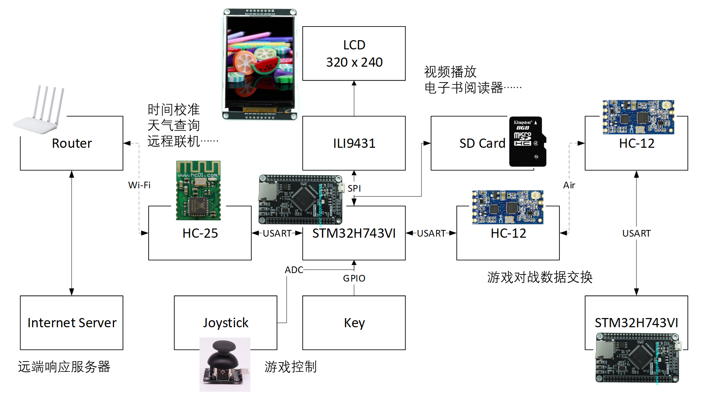

# STM32-Player

基于 STM32H743 的多功能对战游戏机平台。

## 功能介绍

+ **电子书阅读器**。支持 txt 文件，支持大、小两种字号，支持自动记录上次阅读到的位置。
+ **视频播放**。可以播放使用 [Video-Generator](https://github.com/StopPointTeam/Video-Generator) 处理后的视频。带有进度条。
+ **飞机大战**。一个简易的飞机大战游戏。
+ **天气查询**。向使用 [STM32-Player-Server](https://github.com/StopPointTeam/STM32-Player-Server) 搭建的服务器请求天气信息。
+ **五子棋联机对战**。五子棋点对点联机游戏。
+ **设置**。支持夜间模式。

## 系统架构

## 参考资料

[链接](https://github.com/StopPointTeam/STM32-Player-Doc)

## 声明

StopPointTeam 版权所有 2021
